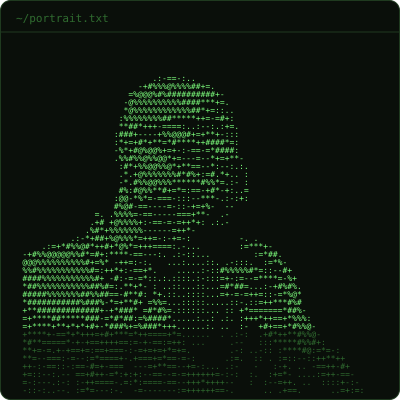
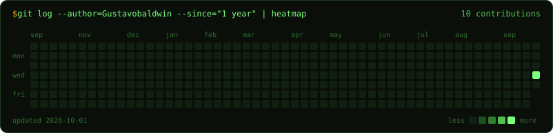

<table>
  <tr>
    <td></td>
    <td></td>
  </tr>
</table>

## Gustavo Macedo Baldwin

**IT Administrator → Information Security / Blue Team**

<!-- Uncomment as you earn them:

-->

**🇺🇸 [English](#-english) · 🇧🇷 [Português](#-português)**

---

### 🇺🇸 English

I run a full Microsoft-centric corporate environment end to end, as a one-person IT team: identity, endpoints, network and security. Now I'm steering that experience toward **information security**, with a focus on defense, detection and compliance.

This GitHub is where I publish what I build along the way: sanitized automation scripts, infrastructure docs and study notes.

- **Identity & cloud:** Microsoft 365, Entra ID, Intune, Exchange Online, hybrid Active Directory
- **Security:** EDR, MFA rollout and compliance tracking, BitLocker, hardening
- **Network:** FortiGate, VLAN segmentation, TP-Link Omada
- **Automation:** PowerShell, Python, Cloudflare Workers

### 🇧🇷 Português

Cuido sozinho de um ambiente corporativo inteiro baseado em Microsoft: identidade, endpoints, rede e segurança. Agora estou direcionando essa experiência para **segurança da informação**, com foco em defesa, detecção e compliance.

Aqui eu publico o que construo no caminho: scripts de automação sanitizados, documentação de infraestrutura e anotações de estudo.

- **Identidade e nuvem:** Microsoft 365, Entra ID, Intune, Exchange Online, Active Directory híbrido
- **Segurança:** EDR, implantação e acompanhamento de MFA, BitLocker, hardening
- **Rede:** FortiGate, segmentação de VLANs, TP-Link Omada
- **Automação:** PowerShell, Python, Cloudflare Workers

---

The portrait, card and heatmap are SVGs generated by the Python scripts in <code>/scripts</code> and refreshed daily by GitHub Actions.
